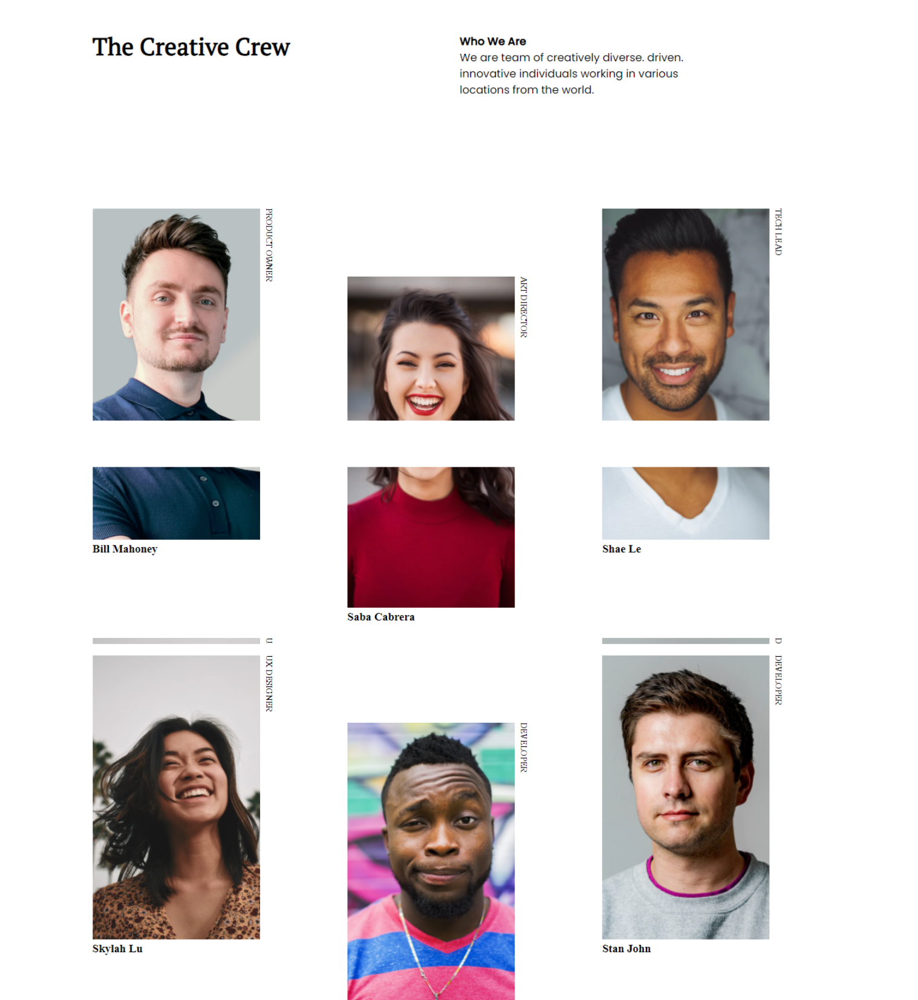

<!-- Please update value in the {}  -->

<h1 align="center">{Your project name}</h1>

   Solution for a challenge from  <a href="http://devchallenges.io" target="_blank">Devchallenges.io</a>.

  <h3>
    <a href="https://{your-demo-link.your-domain}">
      Demo
    </a>
     | 
    <a href="https://github.com/abkardev/my-team-page">
      Solution
    </a>
     | 
    <a href="https://devchallenges.io/challenges/hhmesazsqgKXrTkYkt0U">
      Challenge
    </a>
  </h3>

<!-- TABLE OF CONTENTS -->

## Table of Contents

- [Overview](#overview)
  - [Built With](#built-with)
- [Features](#features)
- [Contact](#contact)
- [Acknowledgements](#acknowledgements)

<!-- OVERVIEW -->

## Overview

Introduce your projects by taking a screenshot or a gif. Try to tell visitors a story about your project by answering:

- Where can I see your demo?

- What was your experience?
i had fun by building this project so i learnt new thing in this project.
- What have you learned/improved?
i imporvedmy grid knowledge ..so imad emy grid skill solid by building this project .
- Your wisdom? :)
keep learning everyday to be expert one day.

### Built With
this project build with html and css .

## Features

<!-- List the features of your application or follow the template. Don't share the figma file here :) -->

This application/site was created as a submission to a [DevChallenges](https://devchallenges.io/challenges) challenge. The [challenge](https://devchallenges.io/challenges/hhmesazsqgKXrTkYkt0U) was to build an application to complete the given user stories. i used felxbox and grid to build this website.

## Contact

- Website [your-website.com](https://abkardev.github.io/me/)
- GitHub [@your-username](https://github.com/abkardev)
- Twitter [@your-twitter](https://{twitter.com/your-username})
